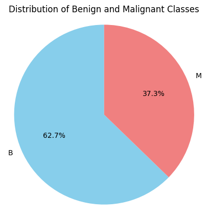
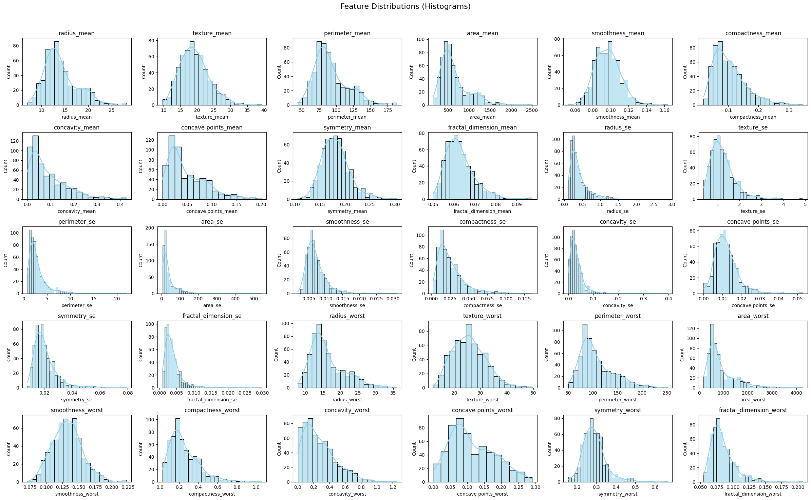
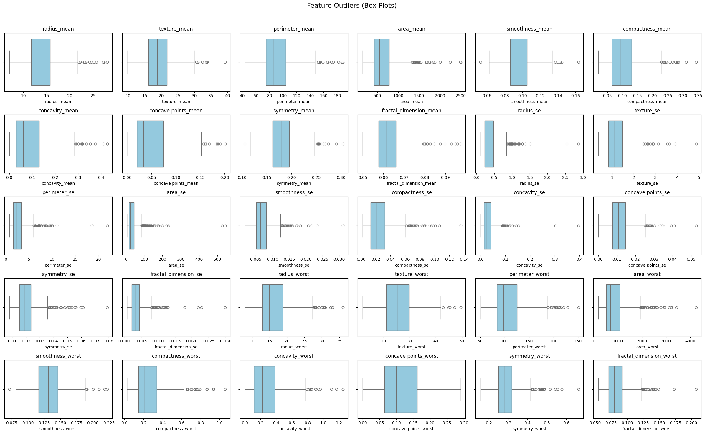
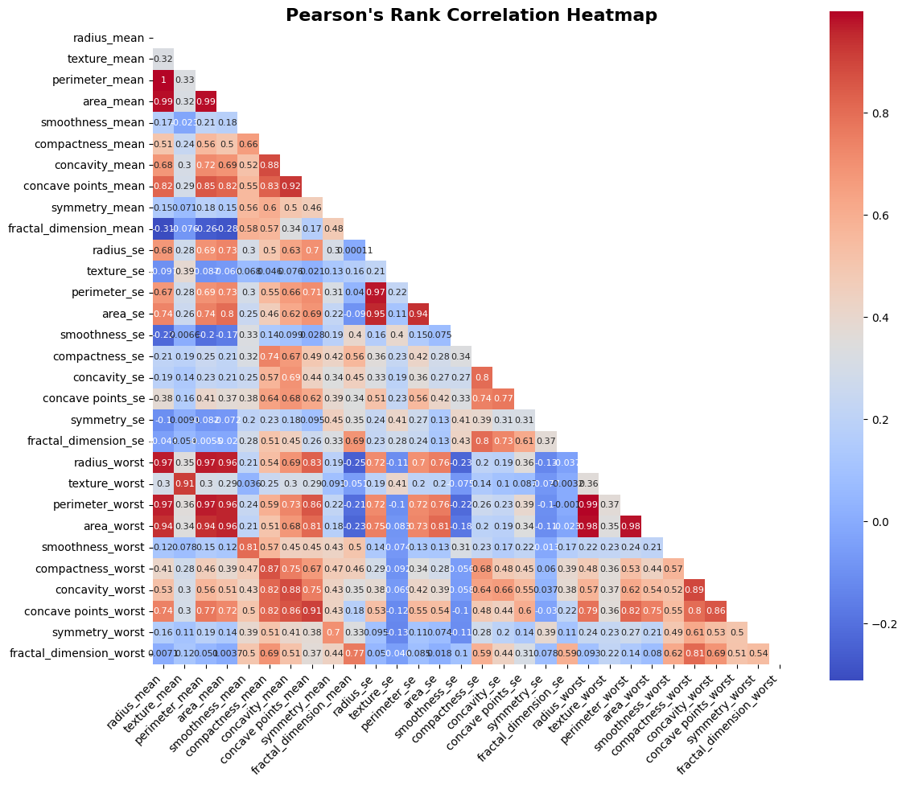
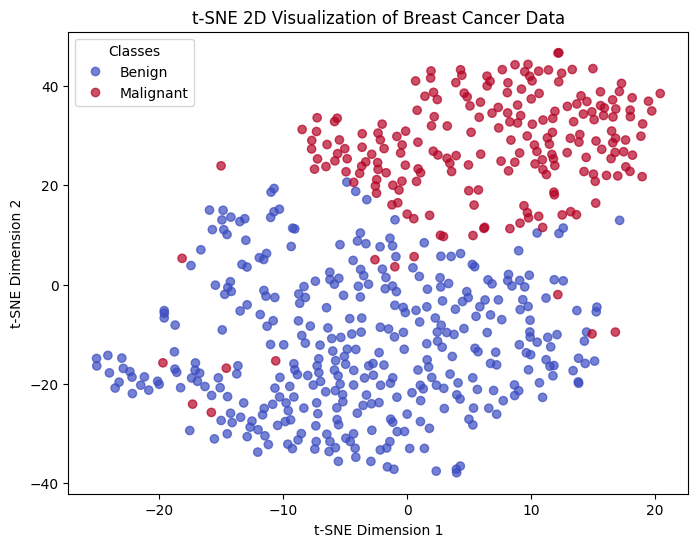
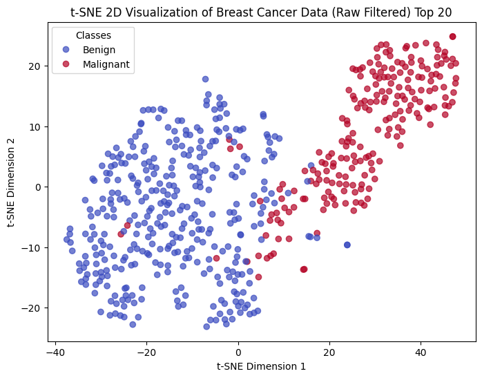
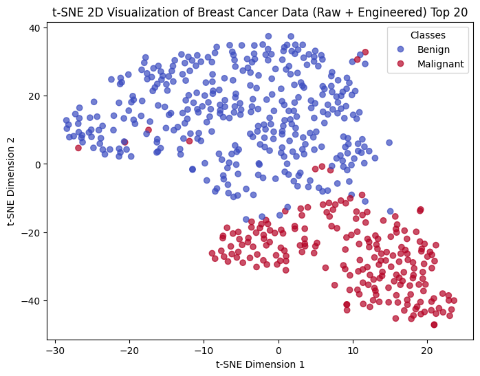

# 📊 A Comparitive Study of ML and DL models for Breast Cancer Classification
The following project focuses on improving classification accuracy on the Breast Cancer Wisconsin Dataset by using specially engineered features, interpretable feature selection, and efficient dimensionality reduction. These approaches reduce the complexity of training and inference while incurring negligible trade-offs. Another key objective is to increase the recall of the malignancy class, which is a critical requirement for any clinically applicable machine learning or deep learning model.

 

## ***📑 Executive Summary***
This project presents a comparative study of machine learning (ML) and deep learning (DL) models for breast cancer classification using the Breast Cancer Wisconsin Dataset. By applying advanced feature engineering, interpretable feature selection, and robust dimensionality reduction techniques, the original high-dimensional feature set was efficiently reduced to between 7 and 10 key features across all models. This substantial reduction minimized training and inference complexity while maintaining or improving model performance.

The pipeline incorporated thorough data preprocessing, domain-informed feature creation, two-tier feature selection (using mRMR and Random Forest importance), and permutation-based feature importance to identify the most clinically relevant features. Models evaluated include Random Forest, Support Vector Machines, XGBoost, and Neural Networks, each optimized via stratified cross-validation and randomized hyperparameter search.

A critical focus was improving the recall of the malignancy class, a vital metric for clinical applicability. Among all models, the Neural Network trained on the RAW feature pool (20 features filtered via mRMR + tree-based significance in EDA) achieved the highest overall accuracy of 0.9912 on the test set, with a malignant recall of 0.9762. The second-best model was XGBoost trained on the RAW feature pool (also 20 features), achieving a test accuracy of 0.98 and malignant recall of 0.98. Even though these top results are from RAW feature pools, we observed comparable (if not identical) performance on ENG feature pools as well; moreover, the engineered features were better suited for significant dimensionality reduction—we will report those metrics separately in detail later.

These results confirm that effective dimensionality reduction combined with rigorous modeling strategies can yield clinically meaningful breast cancer classifiers that are both accurate and efficient. This project validates the practical utility of combining interpretable feature selection with powerful ML and DL methods to achieve high-accuracy, low-complexity models suitable for deployment in clinical decision-making.

| Metric         | Precision | Recall  | F1-score | Support |
|----------------|-----------|---------|----------|---------|
| Benign         | 0.9863    | 1.0000  | 0.9931   | 72      |
| Malignant      | 1.0000    | 0.9762  | 0.9880   | 42      |
| **Accuracy**   |           |         | **0.9912** | 114    |
| **Macro Avg**  | 0.9932    | 0.9881  | 0.9905   | 114     |
| **Weighted Avg**| 0.9913   | 0.9912  | 0.9912   | 114     |

*Table: Test Classification Report for the Neural Network model trained on 20 features from the RAW feature pool.*

| Metric         | Precision | Recall  | F1-score | Support |
|----------------|-----------|---------|----------|---------|
| Benign         | 0.99      | 0.99    | 0.99     | 72      |
| Malignant      | 0.98      | 0.98    | 0.98     | 42      |
| **Accuracy**   |           |         | **0.98** | 114     |
| **Macro Avg**  | 0.98      | 0.98    | 0.98     | 114     |
| **Weighted Avg**| 0.98     | 0.98    | 0.98     | 114     |

*Table: Classification Report on the test set for the XGBoost model trained on 20 features from the RAW feature pool.*

 

## ***🚀 Project Motivation & Impact***

Breast cancer remains one of the most prevalent and deadly cancers worldwide, with early and accurate diagnosis playing a pivotal role in improving patient outcomes. Motivated by the critical need for effective diagnostic tools, I chose this project to explore how advanced machine learning (ML) and deep learning (DL) techniques can be harnessed for automated, reliable breast cancer classification.

The Breast Cancer Wisconsin Dataset offers a rich yet challenging ground for developing such models due to its moderate size, feature diversity, and the clinical importance of correctly identifying malignant cases. This project tackled these challenges head-on by focusing on interpretable feature engineering, rigorous feature selection, and dimensionality reduction. These strategies not only enhanced model accuracy but, importantly, addressed clinical priorities such as maximizing the recall of malignancy to minimize false negatives—a crucial factor in real-world healthcare applications.

What makes our approach novel and impactful is the integration of domain-informed feature construction with cutting-edge model tuning and evaluation pipelines. We carefully balanced model complexity and interpretability, resulting in compact yet highly performant classifiers that reduce computational demand without compromising clinical sensitivity. This balance is critical for translating ML solutions from research to practical, deployable tools in healthcare settings where transparency and efficiency are paramount.

The promising performance metrics achieved—especially the high malignant recall and overall accuracy across ML and DL models—underscore the robustness and clinical relevance of this solution. The results pave the way for scaling this methodology to larger, more complex datasets, potentially incorporating multimodal data, to further improve cancer detection systems. 

Above all, this project reflects my deep passion for applying data science to solve meaningful healthcare problems. It demonstrates a commitment to rigorous experimentation, critical analysis, and a continuous drive to advance technologies that can save lives. I am excited about the future possibilities this work unlocks and eager to contribute such impactful solutions in clinical AI research and development.

 

## ***📈 Summary of EDA***

In this section, we focus on understanding the structure of the dataset before proceeding with preprocessing or modeling steps. The primary goal is to identify the most significant features, given that the Wisconsin Breast Cancer Dataset is relatively high-dimensional (30 features, including 10 discriminative features each with 3 variant types).

### ***Initial Data Audit and Info***

- The dataset was inspected for structure, missing values, and class distribution. This includes dropping irrelevant columns and auditing for nulls or duplicates.
- Visualization of class balance was conducted to ensure awareness of potential class imbalance prior to modeling.

*Conclusion: The Wisconsin Breast Cancer Dataset is clean, with no missing values and a mild class imbalance; benign and malignant samples are well represented.*

---

### Skewness and Kurtosis Analysis

- Skewness and kurtosis were computed for each feature to characterize data distributions, spot non-normality, and highlight features with heavy tails or outliers.
- This helped in identifying features which might need robust scaling or special handling.

*Conclusion: The data shows significant skewness and heavy tails, especially in certain clinical measurements, indicating meaningful medical outliers that should be preserved.*

---

### Univariate Analysis

- Histograms and box plots were generated for each feature to visually assess distribution, spot outliers, and support downstream feature engineering decisions.

*Conclusion: Most features follow a Gaussian-like distribution but with meaningful outliers, reinforcing the need for robust preprocessing rather than removal.* 

---

### Bivariate Analysis

- Pairwise correlations were computed (Pearson matrix) to assess multicollinearity and relationships among features and with the target label.
- Strong correlations were spotted among classic morphological groups (area, perimeter, radius) and between shape descriptors (concavity, compactness, concave points).

*Conclusion: Collinearity exists among groups of features and motivates careful feature selection and possible dimensionality reduction.*

---

### Dimensionality Reduction & Visualization

- t-SNE was used to reduce the dataset to two dimensions and visualize the separability of benign and malignant classes across raw, engineered, and original feature spaces.

  
  
  

*Conclusion: Both raw and engineered features yield good class separation with t-SNE, though engineered features maintain separation with fewer dimensions, supporting feature engineering's efficacy.*

---

### Feature Engineering Ideas

- Drawing on EDA findings, novel domain-specific features were designed (e.g., ratios, shape metrics), and their importances were quantified.
- These engineered features were considered for boosting model interpretability and discriminative power alongside raw variables.

*Conclusion: Domain-informed engineered features show high correlation with the target and enable more efficient modeling with fewer variables.*

---

### Feature Selection and Ranking

- Two-stage feature selection—first with mRMR (minimum redundancy maximum relevance), then tree-based importance—was applied to filter noise and redundancy.
- Ranked features were visualized and prioritized for modeling pipelines.

*Conclusion: Effective feature selection reduces redundancy and keeps only the most informative features, supporting simpler, more generalizable models.*

---

### Finalizing Feature Pools and Findings

- EDA concluded with selected compact feature pools (raw and engineered) to be used for all modeling, striking a balance between dimensionality and classification power.

*Conclusion: The EDA process ensured a deep understanding of data structure, supported principled feature selection, and set the stage for robust, interpretable ML and DL pipelines.*
